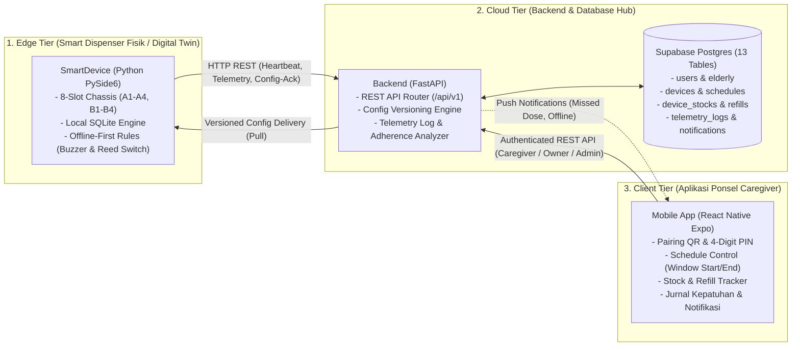
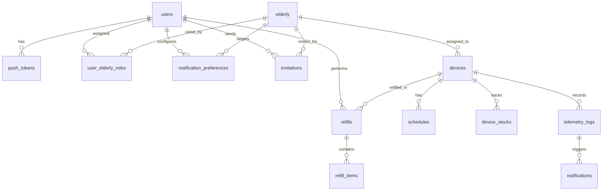

# Dokumentasi Arsitektur Sistem & Spesifikasi Handover PillCare (Revisi v2 — Aligned with API Spec & ERD)
**CE739 Mobile & Pervasive Computing — Smart Pillbox IoT System**

---

## 1. Ringkasan Eksekutif & Arsitektur Sistem (Hub-and-Spoke Pattern)

Sistem **PillCare** adalah ekosistem pemantauan kepatuhan minum obat berbasis *Pervasive & Ambient Computing* untuk lansia dengan kondisi kronis (*multimorbidity*). Sistem ini mengintegrasikan 3 tier utama yang dimediasi secara eksklusif oleh **Cloud Tier (FastAPI Backend)**:



---

## 2. Analisis Ketidakselarasan & Resolusi Terhadap Dokumen Desain Resmi

Berdasarkan telaah mendalam terhadap **Dokumen API Specification (13 Halaman)** dan **Database ERD (dbdiagram.io)**, berikut adalah perbaikan dan penyesuaian yang telah diselaraskan pada dokumen handover ini:

| No | Area / Komponen | Dokumen Handover Lama (Draft Awal) | Spesifikasi Resmi (API Spec & ERD) | Dampak & Resolusi Integrasi |
| :---: | :--- | :--- | :--- | :--- |
| **1** | **Heartbeat Response** | `{"status": "ok", "requires_config_sync": bool}` | `{"server_time": str, "latest_config_version": int, "config_update_available": bool}` | Mengganti key flag menjadi `config_update_available`. Menambahkan `server_time` untuk mendeteksi *clock drift* pada RTC lokal alat. |
| **2** | **Konfirmasi Konfigurasi** | Tidak ada (*one-way pull*) | `POST /devices/{device_id}/config-ack` | Menambahkan endpoint ACK agar Backend mengetahui kepastian bahwa jadwal baru telah diterapkan di perangkat (*reconciliation loop*). |
| **3** | **Unduh Konfigurasi** | `GET /devices/{device_id}/config` tanpa param | Mendukung query param `?since_version={int}` dan response `HTTP 304 Not Modified` | Menghemat bandwidth jaringan seluler/Wi-Fi alat jika versi konfigurasi di perangkat sudah up-to-date. |
| **4** | **Telemetry Response & Audit** | `{"status": "success", "received_count": int}` | `{"server_time": str, "accepted": int, "duplicates": int, "rejected": [...], "latest_config_version": int}` | Menyediakan response detail audit idempotensi. Event yang terkirim ulang saat network retry dicatat sebagai `duplicates` tanpa merusak data. |
| **5** | **Representasi Jadwal** | Single time (`schedule_time: "07:00"`), nama lokal `sebelum_makan`/`pagi` | Rentang waktu: `window_start`, `window_end`, `row_type: "A \| B"`, `day_period: "MORNING \| AFTERNOON \| EVENING \| NIGHT"` | Mengadopsi standar farmasi grid A1-A4 & B1-B4. Obat memiliki rentang jendela konsumsi (*window period*), bukan titik waktu tunggal. |
| **6** | **Manajemen Stok & Refill** | Kolom `stock_count` saja di bilik, refill lokal | Tabel terpisah: `device_stocks`, `refills`, dan `refill_items`. Endpoint: `refill-mode`, `refills`, `stock` | Memisahkan inventaris stok fisik dari aturan jadwal, serta mencatat audit transaksi siapa caregiver yang melakukan isi ulang sachet. |
| **7** | **Tabel Database Backend** | Hanya dicatat 3 tabel sampel generik | **13 Tabel Resmi Relasional** di Supabase Postgres | Seluruh nama tabel dan kolom disesuaikan persis dengan dbdiagram.io (`telemetry_logs`, `battery_percentage`, `devices`, dll.). |
| **8** | **Lifecycle & Security Perangkat** | Static device ID (`sim-01`), tanpa auth | Pairing QR (`POST /devices/pairing/scan`), Set 4-digit PIN (`POST /devices`), Join via PIN, Ganti PIN, Kalibrasi Jam RTC | Menyediakan alur keamanan nyata berbasis Device Key (`X-Device-Key`) dan Device PIN 4-digit. |

---

## 3. Spesifikasi Kontrak API Perangkat (Edge Device Protocol)

Seluruh komunikasi perangkat menggunakan Base URL: `http://localhost:8000/api/v1` dengan autentikasi header `X-Device-Key: <token>`.

### A. Heartbeat Berkala Perangkat
*Dipanggil oleh SmartDevice secara periodik (setiap 15–30 detik).*

- **Method / URL**: `POST /devices/{device_id}/heartbeat`
- **Request Body**:
  ```json
  {
    "sent_at": "2026-09-30T14:05:00+07:00",
    "battery_percent": 98,
    "wifi_rssi_dbm": -50,
    "rtc_time": "2026-09-30T14:05:00+07:00",
    "config_version_applied": 1,
    "chambers": [
      {"slot_number": 1, "door": "CLOSED"},
      {"slot_number": 2, "door": "CLOSED"},
      {"slot_number": 3, "door": "CLOSED"},
      {"slot_number": 4, "door": "CLOSED"},
      {"slot_number": 5, "door": "CLOSED"},
      {"slot_number": 6, "door": "CLOSED"},
      {"slot_number": 7, "door": "CLOSED"},
      {"slot_number": 8, "door": "CLOSED"}
    ]
  }
  ```
- **Response (200 OK)**:
  ```json
  {
    "server_time": "2026-09-30T14:05:00+07:00",
    "latest_config_version": 2,
    "config_update_available": true
  }
  ```
- **Kode Error**: `401 DEVICE_KEY_INVALID`

---

### B. Mengunduh Konfigurasi Jadwal (Config Pull)
*Dipanggil saat `config_update_available == true` pada response Heartbeat atau saat perangkat pertama kali booting.*

- **Method / URL**: `GET /devices/{device_id}/config?since_version=1`
- **Response (200 OK - Jika ada versi baru)**:
  ```json
  {
    "config_version": 2,
    "timezone": "Asia/Jakarta",
    "schedules": [
      {
        "schedule_id": "sch_01j8x9b...",
        "slot_number": 1,
        "window_start": "07:00",
        "window_end": "08:00",
        "tolerance_minutes": 30,
        "days_of_week": [1, 2, 3, 4, 5, 6, 7],
        "active": true
      },
      {
        "schedule_id": "sch_01j8x9c...",
        "slot_number": 5,
        "window_start": "07:30",
        "window_end": "08:30",
        "tolerance_minutes": 30,
        "days_of_week": [1, 2, 3, 4, 5, 6, 7],
        "active": true
      }
    ]
  }
  ```
- **Response (304 Not Modified)**: Jika query `since_version` sama dengan versi server (tanpa payload body).

---

### C. Konfirmasi Penerapan Konfigurasi (Config ACK)
*Wajib dikirimkan oleh perangkat segera setelah konfigurasi berhasil di-parse dan disimpan di database lokal.*

- **Method / URL**: `POST /devices/{device_id}/config-ack`
- **Request Body**:
  ```json
  {
    "config_version": 2,
    "applied_at": "2026-09-30T14:05:05+07:00"
  }
  ```
- **Response (200 OK)**:
  ```json
  {
    "acknowledged": true,
    "config_version_applied": 2
  }
  ```
- **Kode Error**: `409 CONFIG_VERSION_UNKNOWN`

---

### D. Pengiriman Log Kejadian & Telemetri (Telemetry Batch Ingestion)
*Mengirimkan antrean event fisik (buka pintu, alarm timeout, refill) dengan prinsip idempotensi penuh.*

- **Method / URL**: `POST /devices/{device_id}/telemetry`
- **Request Body**:
  ```json
  {
    "batch_id": "b1a7d6e4-4d1a-4c9f-8e3b-9a8c7b6d5e4f",
    "events": [
      {
        "event_id": "ev_01j8xa1...",
        "event_type": "COMPARTMENT_OPENED",
        "slot_number": 1,
        "schedule_id": "sch_01j8x9b...",
        "occurred_at": "2026-09-30T07:15:22+07:00",
        "chime_count": 3
      },
      {
        "event_id": "ev_01j8xa2...",
        "event_type": "ALARM_TIMEOUT",
        "slot_number": 6,
        "schedule_id": "sch_01j8x9d...",
        "occurred_at": "2026-09-30T13:00:00+07:00",
        "chime_count": 30
      }
    ]
  }
  ```
- **Valid Enum `event_type`**:
  `POPUP_ACTIVATED` | `COMPARTMENT_OPENED` | `COMPARTMENT_CLOSED` | `ALARM_TIMEOUT` | `UNSCHEDULED_OPEN` | `REFILL_MAINTENANCE`
- **Response (200 OK)**:
  ```json
  {
    "server_time": "2026-09-30T14:05:10+07:00",
    "accepted": 2,
    "duplicates": 0,
    "rejected": [],
    "latest_config_version": 2
  }
  ```
- **Kode Error**: `401 DEVICE_KEY_INVALID`, `413 BATCH_TOO_LARGE`, `422 VALIDATION_ERROR`

---

## 4. Pemetaan Lengkap Database Supabase Postgres (13 Tabel Sesuai ERD)

Berdasarkan diagram resmi `dbdiagram.io`, berikut adalah skema database terpusat pada Backend:



### Kamus Kolom Kunci:
1. **`devices`**:
   `id (PK)`, `device_code (Unique)`, `elderly_id (FK)`, `master_password_hash`, `device_pin_hash`, `device_nickname`, `timezone`, `auto_sync_timezone`, `chime_volume_level ("LOW"|"MEDIUM"|"HIGH")`, `status ("ONLINE"|"OFFLINE")`, `battery_percentage (Int)`, `config_version (Int)`, `last_heartbeat (Timestamp)`, `created_at`, `updated_at`.
2. **`schedules`**:
   `id (PK)`, `device_id (FK)`, `slot_number (1-8)`, `row_type ("A"|"B")`, `day_period ("MORNING"|"AFTERNOON"|"EVENING"|"NIGHT")`, `medication_name`, `dosage_info`, `window_start (Time)`, `window_end (Time)`, `tolerance_minutes (15\|30\|45\|60)`, `days_of_week (Varchar/Array)`, `is_active (Boolean)`, `created_at`, `updated_at`.
3. **`device_stocks`**:
   `id (PK)`, `device_id (FK)`, `slot_number (1-8)`, `remaining_units (Int)`, `updated_at (Timestamp)`.
4. **`refills` & `refill_items`**:
   - `refills`: `id (PK)`, `device_id (FK)`, `refilled_by_user_id (FK)`, `refilled_at`, `created_at`.
   - `refill_items`: `id (PK)`, `refill_id (FK)`, `slot_number (1-8)`, `unit_dose_count (Int)`.
5. **`telemetry_logs`**:
   `id (PK)`, `device_id (FK)`, `schedule_id (FK)`, `slot_number (1-8)`, `event_type`, `status ("TAKEN"|"MISSED"|"PENDING")`, `delay_minutes`, `actual_open_time`, `actual_close_time`, `chime_count`, `log_source ("AUTO_SENSOR"|"MANUAL_CAREGIVER_CONFIRMATION")`, `confirmed_by_user_id (FK)`, `confirmation_note`, `recorded_at`, `created_at`.
6. **`notifications`**:
   `id (PK)`, `user_id (FK)`, `elderly_id (FK)`, `device_id (FK)`, `telemetry_log_id (FK)`, `type ("DOSE_LATE"|"DOSE_MISSED"|"DOSE_TAKEN"|"DEVICE_OFFLINE"|"DEVICE_ONLINE"|"LOW_BATTERY")`, `severity ("INFO"|"WARNING"|"CRITICAL")`, `message`, `is_read`, `is_resolved`, `resolved_by_user_id`, `resolved_at`, `resolution_note`, `created_at`.

---

## 5. Ringkasan Endpoint Aplikasi Mobile (Caregiver Portal)

Berikut adalah daftar endpoint REST API yang dikonsumsi oleh aplikasi **React Native (`Mobile/`)**:

### A. Autentikasi & Akun Caregiver
- `POST /auth/register` & `POST /auth/login` (Email & Password)
- `POST /auth/google` (Google OAuth ID Token)
- `POST /auth/refresh`, `POST /auth/forgot-password`, `POST /auth/reset-password`
- `GET /setting` & `PUT /setting` (Profil, bahasa ID/EN, mode LIGHT/DARK)
- `POST /setting/push-tokens` & `DELETE /setting/push-tokens/{id}` (Token FCM/APNs)

### B. Profil Lansia & Multi-Caregiver
- `POST /elderly` & `GET /elderly` (Melihat semua lansia yang dipantau + agregat kepatuhan hari ini)
- `GET /elderly/{elderly_id}` (Detail lansia & daftar perangkat yang terhubung)
- `POST /elderly/{elderly_id}/caregivers` (Undang perawat lain: role ADMIN / PEMANTAU)
- `GET /elderly/{elderly_id}/notification-preferences` & `PUT ...` (Setting jalur Push / WhatsApp)

### C. Manajemen Perangkat (Pairing & Status)
- `POST /devices/pairing/scan` (Validasi QR code)
- `POST /devices` (Pairing baru dengan PIN 4-digit, pembuat jadi OWNER)
- `POST /devices/{device_id}/join` (Caregiver lain gabung via PIN)
- `GET /devices` & `GET /devices/{device_id}` (Detail 8 slot & status baterai/sinyal)
- `GET /devices/{device_id}/clock` & `POST /devices/{device_id}/clock/calibrate` (Monitoring & kalibrasi drift jam)

### D. Kontrol Jadwal Obat (Schedule Control)
- `POST /devices/{device_id}/schedules` (Tambah jadwal slot)
- `GET /devices/{device_id}/schedules` (Daftar semua jadwal 8 slot)
- `PUT /devices/{device_id}/schedules/{schedule_id}` (Edit jendela minum & toleransi)
- `POST /devices/{device_id}/schedules/validate` (Dry-run pencegahan tabrakan jam bilik)

### E. Stok & Refill Mingguan/Bulanan
- `POST /devices/{device_id}/refill-mode` (Aktifkan/matikan mode isi ulang dari aplikasi)
- `POST /devices/{device_id}/refills` (Simpan batch penambahan sachet per slot)
- `GET /devices/{device_id}/stock` (Melihat sisa unit & perkiraan tanggal sachet habis)

### F. Jurnal Kepatuhan & Notifikasi
- `GET /elderly/{elderly_id}/journal/calendar?month=YYYY-MM` (Status indikator kalender bulanan)
- `GET /elderly/{elderly_id}/journal/{date}` (Kartu detail dosis harian: tepat waktu/terlambat/missed)
- `PUT /journal/dose-logs/{id}/manual-confirmation` (Override manual jika lansia minum tanpa sensor)
- `GET /notifications` & `PUT /notifications/{id}/resolve` (Pusat peringatan & penyelesaian insiden)

---

## 6. Checklist Handover untuk Rekan Tim (Actionable Tasks)

### 📌 Checklist Rekan Backend (`Backend/`)
- [ ] 1. Buat router `app/api/routes/devices.py` dan daftarkan ke `app/main.py`.
- [ ] 2. Implementasikan 4 endpoint Device Protocol:
  - `POST /api/v1/devices/{device_id}/heartbeat`
  - `GET /api/v1/devices/{device_id}/config`
  - `POST /api/v1/devices/{device_id}/config-ack`
  - `POST /api/v1/devices/{device_id}/telemetry`
- [ ] 3. Buat skema migrasi tabel Supabase sesuai 13 tabel di bagian 4 (pastikan menggunakan `telemetry_logs` dan `device_stocks`).
- [ ] 4. Tambahkan validasi `WINDOW_OVERLAP` pada penambahan jadwal slot.
- [ ] 5. Implementasikan background worker untuk memicu FCM push notification saat event `ALARM_TIMEOUT` masuk ke `telemetry_logs`.

### 📌 Checklist Rekan Mobile (`Mobile/`)
- [ ] 1. Bangun UI Dashboard Lansia (`GET /elderly`) dengan ringkasan status obat hari ini (*Scheduled, Taken, Missed*).
- [ ] 2. Buat layar *Schedule Control* (Grid 8 bilik A1-A4 & B1-B4) dengan input rentang jam `window_start` & `window_end`.
- [ ] 3. Implementasikan layar *Refill Mode Control* & *Stock Overview* (`GET /devices/{device_id}/stock`).
- [ ] 4. Buat Kalender Jurnal Kepatuhan (`GET /elderly/{elderly_id}/journal/calendar`) dengan indikator warna harian (*Green, Yellow, Red*).
- [ ] 5. Hubungkan token push notification perangkat seluler ke `POST /setting/push-tokens`.
