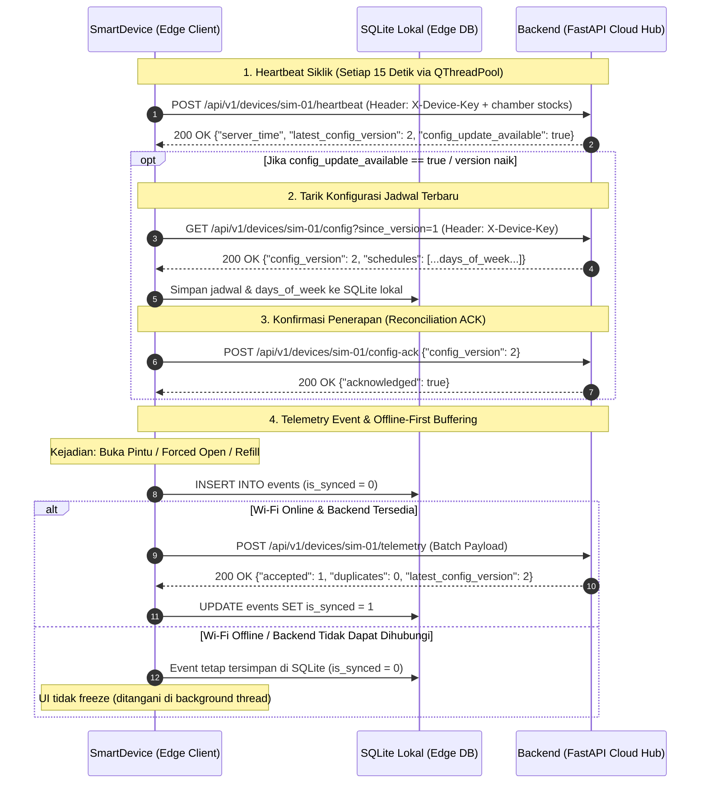

# 📱 Spesifikasi Lengkap, Arsitektur & Fitur Smart Device Emulator
**CE739 Mobile & Pervasive Computing — Smart Pillbox IoT Digital Twin**

---

## 1. Ringkasan Eksekutif & Filosofi Desain

Modul **SmartDevice** (`SmartDevice/`) adalah **Tactile Digital Twin** berbasis desktop (Python & PySide6/Qt) yang merepresentasikan perangkat fisik *Smart Dispenser Pillbox* secara fidelitas tinggi. Simulator ini dirancang untuk memenuhi prinsip utama *Pervasive & Ambient Computing*: **menghilangkan beban kognitif lansia** melalui otomatisasi sensoris dan fisik, tanpa memerlukan antarmuka layar sentuh (*touchscreen-less*) pada sasis fisik alat.

```
+----------------------------------------------------------------------------------------------------+
|                                    TAMPILAN TACTILE DIGITAL TWIN                                   |
+------------------------------------+----------------------------------+----------------------------+
| ZONA 1: MEJA STOK CAREGIVER        | ZONA 2: SASIS FISIK SMART PILLBOX| ZONA 3: MEJA MINUM LANSIA  |
| - Tumpukan Pasokan Sachet          | - Layar Centered OLED Display    | - Gelas Air Minum          |
| - Tombol Aksi Quick Refill         | - Matriks 2x4 Bilik (Slot 1 - 8) | - Drop Zone Konsumsi Obat  |
| - Status Kunci Refill Mode         | - LED Breathing & Mekanisme Pop-up| - Log Riwayat Minum Pasien |
+------------------------------------+----------------------------------+----------------------------+
|                       ZONA 4: DEVELOPER LAB WORKBENCH (PANEL KONTROL BAWAH)                        |
| - RTC Speed (1x, 10x, 60x) | +1 Jam  | Toggle Wi-Fi | Slider Baterai | Toggle Refill Mode          |
+----------------------------------------------------------------------------------------------------+
```

### Pilar Filosofi:
1. **Tactile Digital Twin (Manipulasi Fisik Langsung):** 
   Alat asli di dunia nyata tidak memiliki tombol sentuh seperti smartphone. Obat diambil dengan cara menarik sachet yang disembulkan (*solenoid push-up*) dari bilik fisik yang terbuka. Di simulator, hal ini diwujudkan dengan interaksi **Drag-and-Drop** alami:
   - **Mengisi obat (Refill):** Sachet ditarik dari Meja Caregiver (Zona 1) lalu dilepas ke Bilik Slot (Zona 2) saat Refill Mode aktif.
   - **Meminum obat (Intake):** Sachet yang menyembul dari Bilik Aktif (Zona 2) ditarik lalu dilepas ke Meja Minum Lansia (Zona 3).
   - **Akses Paksa di Luar Jadwal (Forced Open):** Double-click pada bilik terkunci (IDLE) mensimulasikan sensor reed switch mendeteksi pintu dibuka paksa (`UNSCHEDULED_OPEN`). Klik satu kali pada pintu terbuka untuk menutupnya kembali (`COMPARTMENT_CLOSED`).
2. **Clean Dark-Slate Medical IoT Aesthetic:**
   Menggunakan palet warna slate modern berstandar alat medis (`#0F172A`, `#1E293B`, `#334155`) dengan aksen Medical Cyan (`#06B6D4`). Menghilangkan elemen kartun atau emoji yang membingungkan, menghasilkan visual instrumen medis profesional.
3. **Ambient & Autonomous (Offline-First):**
   Dispenser memiliki Real-Time Clock (RTC) mandiri dan basis data lokal SQLite (`pillbox_local.db`). Jika jaringan Wi-Fi terputus, alarm buzzer tetap berbunyi sesuai jadwal lokal dan seluruh insiden tercatat aman di buffer lokal.

---

## 2. Struktur Direktori & Komponen Perangkat Lunak

Struktur kode di dalam direktori `SmartDevice/` dibagi secara modular:

```
SmartDevice/
├── main.py                     # Entry point eksekusi emulator PySide6
├── pillbox_local.db            # Basis data SQLite lokal (Offline-First Storage)
├── requirements.txt            # Dependensi Python (PySide6, requests, pytest)
├── smart_pillbox/
│   ├── config.py               # Konstanta sistem, layout bilik, URL backend & timing
│   ├── models.py               # Data class & Enum (Compartment, ChamberState, TelemetryEvent)
│   ├── core/                   # Logika Inti Perangkat Keras & Penjadwalan
│   │   ├── scheduler.py        # Mesin status (FSM) jadwal bilik, evaluasi days_of_week, alarm, & deteksi dosis
│   │   ├── rtc.py              # Simulator jam fisik RTC (Mendukung percepatan waktu)
│   │   ├── audio.py            # Simulator Chime Buzzer audio
│   │   └── sync.py             # HTTP Client sinkronisasi telemetri, heartbeat, config-ack ke Cloud
│   ├── db/                     # Lapisan Akses Data Lokal
│   │   ├── database.py         # Abstraksi koneksi SQLite & operasi CRUD event/state/days_of_week
│   │   └── schema.sql          # DDL tabel lokal (compartments, schedules, events, device_state)
│   └── gui/                    # Antarmuka Pengguna Visual (PySide6)
│       ├── main_window.py      # Pengatur tata letak 3-Zona, Worker Thread, & Workbench
│       ├── lcd_widget.py       # Widget Centered OLED Display
│       ├── compartment_widget.py # Widget bilik fisik 1-8 dengan LED, sachet canvas, drag-drop, & double-click
│       ├── sachet_graphic.py   # Procedural vector drawing tumpukan sachet medis
│       ├── caregiver_tray_widget.py # Zona 1: Meja pasokan stok caregiver & bulk refill
│       ├── lansia_tray_widget.py    # Zona 3: Meja samping tempat tidur lansia & gelas minum
│       └── styles.py           # Design tokens, warna Dark Slate, & konstanta CSS Qt
└── tests/                      # Unit testing core logic
```

### Penjelasan Modul Inti (`smart_pillbox/core/`):
- **`scheduler.py` (`PillboxScheduler`)**:
  - Mengelola siklus hidup 8 bilik obat.
  - Memastikan batasan sistem: **Hanya ada maksimal 1 bilik aktif dalam satu waktu (*Single Active Chamber*)**.
  - **Evaluasi Jadwal Berbasis Hari (`days_of_week`):** Mengevaluasi array hari aktif `[1..7]` (ISO weekday, 1=Senin..7=Minggu) terhadap waktu RTC. Mencegah alarm berbunyi pada hari yang tidak dijadwalkan saat waktu simulasi dimajukan.
  - Mengimplementasikan `get_next_dose()` untuk mencari jadwal terdekat berikutnya di hari aktif yang sama.
  - Mengendalikan status bilik: `IDLE` $\rightarrow$ `ACTIVE` (pintu terbuka & obat terangkat) $\rightarrow$ `TAKEN` (obat diambil lansia) atau `MISSED` (waktu toleransi habis).
- **`rtc.py` (`SimulatedClock`)**:
  - Mensimulasikan chip hardware RTC (seperti DS3231).
  - Menyimpan timestamp ISO 8601 lengkap (`YYYY-MM-DDTHH:MM:SS`).
  - Mendukung skala kecepatan waktu simulasi (`1.0x`, `10.0x`, `60.0x`) dan fungsi `jump(timedelta)` untuk melompat 1 jam ke depan guna mempermudah pengujian evaluator tanpa harus menunggu waktu nyata.
- **`sync.py`**:
  - Mengatur pengiriman HTTP request ke FastAPI Cloud Backend secara *non-blocking* (`QThreadPool`).
  - Mendukung sinkronisasi stok sachet via `chambers[].stock_count` pada Heartbeat.
  - Membaca versi konfigurasi dari respon Telemetri maupun Heartbeat (`latest_config_version`).
  - Mengirimkan konfirmasi otomatis `POST /devices/{device_id}/config-ack` segera setelah konfigurasi tersimpan.
  - Melakukan *buffering* lokal otomatis jika server mati atau koneksi internet perangkat terputus.
- **`audio.py`**:
  - Membunyikan nada dering chime buzzer saat bilik masuk ke status `ACTIVE` dan stok obat tersedia.

---

## 3. Rincian Antarmuka Pengguna (Visual UI & 3-Zone Architecture)

### 🟩 Zona 1: Meja Stok Caregiver (Sisi Kiri)
- **Komponen:** `CaregiverTrayWidget` (lebar tetap: 230px, background slate gelap).
- **Fungsi:** Mensimulasikan tempat perawat/keluarga menyiapkan sachet obat racikan farmasi sebelum dimasukkan ke dispenser.
- **Elemen Visual & Interaksi:**
  - **Pasokan Sachet (`DraggableSachetCard`):** Menampilkan grafik sachet obat berlapis 3D. Menjadi sumber *drag* (`QDrag`) dengan mime-type `application/x-pillcare-sachet`. Saat ditarik, kursor menampilkan *ghost pixmap* transparan 75%.
  - **Status Kunci Bilik:** Label status penutup bilik (*Locked / Unlocked*).
  - **Tombol Quick Bulk Refill:** Pilihan tombol instan untuk mengisi semua 8 slot sekaligus (Opsi: 1, 7, 14, atau 30 sachet per bilik) untuk demonstrasi kilat.

### 🟦 Zona 2: Sasis Fisik Smart Pillbox (Bagian Tengah Utama)
- **Komponen:** Sasis polimer dark slate rounded (`#1E293B`, border `#334155`, radius 16px).
- **Elemen Utama:**
  1. **Centered OLED LCD Display (`LcdDisplay`):**
     - Terletak presisi di posisi tengah atas sasis.
     - Menggunakan background ultra-dark (`#030712`) dan font monospaced (`Consolas`) dengan kontras tinggi.
     - **Baris 1 (Status Hardware):** `JAM: HH:MM:SS WIB | BATT: XX% | WIFI: ON/OFF`
     - **Baris 2 (Banner Utama):**
       - Saat Standby: `NEXT: [Slot X] HH:MM WIB` (Menampilkan jadwal terdekat berikutnya).
       - Saat Waktunya Minum: `AMBIL: [Slot X] HH:MM WIB` (Teks menyala Medical Cyan).
       - Saat Jadwal Tiba namun Stok Kosong: `KOSONG: [Slot X] HH:MM WIB` (Teks Merah Terang).
       - Saat Mode Refill Aktif: `[ REFILL MODE - LID UNLOCKED ]`.
     - **Baris 3 (Indikator Sistem):** `STATUS: IDLE | VER: v1` atau `STATUS: WAKTUNYA MINUM` atau `STATUS: MAINTENANCE`.
  2. **Matriks 2x4 Kompartemen Fisik (8 Bilik):**
     - **Baris Atas (Row A: Slot 1 - 4):** Jadwal *Sebelum Makan* (Pagi, Siang, Sore, Malam).
     - **Baris Bawah (Row B: Slot 5 - 8):** Jadwal *Sesudah Makan* (Pagi, Siang, Sore, Malam).
     - **Anatomi Tiap Bilik (`CompartmentWidget`):**
       - **LED Indicator Bar:** Garis lampu di atas bilik. Efek bernapas (*Breathing Animation*) berkedip lembut saat aktif (`#06B6D4`), Solid Hijau (`#10B981`) saat sudah diminum (*TAKEN*), Merah (`#EF4444`) jika terlambat (*MISSED*), dan Muted Slate jika standby.
       - **Label Waktu & Hubungan Makan:** Misal `Slot 1: Pagi (Sebelum)`.
       - **Canvas Sachet Adaptif (`ChamberCanvas`):** Merender tumpukan sachet 3D prosedural sesuai jumlah stok aktual di dalam bilik (0 s.d. 30 sachet). Saat bilik berstatus `ACTIVE`, sachet paling atas digambar menyembul keluar (*elevated pop-up*) sejauh 30px menandakan mekanisme solenoid fisik sedang mendorong sachet ke atas.
       - **Border Glow:** Slot yang sedang aktif mendapatkan border tebal menyala Cyan (`2px solid #06B6D4`), sedangkan slot lainnya berbingkai tipis netral (`#334155`).
       - **Interaksi Fisik:**
         - **Double-Click:** Membuka paksa penutup bilik saat IDLE untuk simulasi `UNSCHEDULED_OPEN`.
         - **Single Click (Saat Terbuka):** Menutup kembali penutup bilik (`COMPARTMENT_CLOSED`).
         - **Drag-Out (Saat Pop-Up):** Menarik sachet keluar dari bilik menuju Zona 3 untuk diminum (`TAKEN`).
         - **Drop-In (Saat Refill Mode):** Menjatuhkan sachet dari Zona 1 ke dalam bilik untuk isi ulang.

### 🟨 Zona 3: Meja Minum Lansia (Sisi Kanan)
- **Komponen:** `LansiaTrayWidget` (lebar tetap: 230px).
- **Fungsi:** Mensimulasikan meja nakas di samping tempat tidur lansia tempat obat diletakkan dan diminum bersama air putih.
- **Elemen Visual & Interaksi:**
  - **Ilustrasi Gelas Air Medis (`WaterGlassWidget`):** Gambar vektor prosedural gelas air bening dengan coaster kayu dan pantulan kaca realistis.
  - **Drop Zone Target Konsumsi:** Area yang siap menerima drop sachet dari bilik aktif.
  - **Log Riwayat Konsumsi Sesi:** Daftar catatan waktu aktual kapan lansia mengambil dan mengonsumsi obat (misal `07:15 - Slot 1 (Amlodipine 5mg)`).

### ⚙️ Zona 4: Developer Lab Workbench (Panel Kontrol Bawah)
- **Komponen:** Bilah kontrol horisontal (`lab_panel`, tinggi 110px) di bawah sasis untuk keperluan pengujian dan demonstrasi:
  - **RTC Controls:** Dropdown kecepatan waktu (`1.0x`, `10.0x`, `60.0x`), tombol `+1 Hour` (memajukan jam 1 jam seketika), dan tombol `Reset Day to IDLE`.
  - **Network & Sync:** Tombol toggle `Wi-Fi: Online` (Hijau) / `Wi-Fi: Offline` (Merah). Saat offline, koneksi HTTP diputus sengaja untuk membuktikan ketahanan *Offline-First*.
  - **Maintenance:** Tombol `Toggle Refill Mode` untuk membuka/mengunci tutup bilik.
  - **Power Management:** Slider baterai `0% - 100%` untuk menguji telemetri baterai lemah ke server.
  - **Status Bar:** Menampilkan log status sistem real-time.

---

## 4. Mekanisme Komunikasi dengan Backend (Sesuai API Spec Resmi)

Perangkat Smart Device bertindak sebagai **Active IoT Client** yang berkomunikasi dengan Backend FastAPI (`http://localhost:8000/api/v1`) menggunakan protokol **HTTP REST** dan header autentikasi `X-Device-Key`.



### 1. Jalur Heartbeat Berkala (`POST /devices/{device_id}/heartbeat`)
- **Interval:** Dijalankan secara otomatis setiap **15 detik** (`SYNC_INTERVAL_SECONDS = 15`).
- **Non-Blocking Architecture:** Dieksekusi di dalam thread terpisah menggunakan **`QThreadPool`** dan **`QRunnable` (`SyncWorker`)**.
- **Sinkronisasi Stok Otomatis:** Payload menyertakan `stock_count` pada setiap elemen array `chambers`, sehingga Backend otomatis mengetahui perubahan stok lokal akibat pengisian cepat (Quick Refill).
- **Payload Request:**
  ```json
  {
    "sent_at": "2026-09-30T14:05:00+07:00",
    "battery_percent": 98,
    "wifi_rssi_dbm": -50,
    "rtc_time": "2026-09-30T14:05:00+07:00",
    "config_version_applied": 1,
    "chambers": [
      {"slot_number": 1, "door": "CLOSED", "stock_count": 7},
      {"slot_number": 2, "door": "CLOSED", "stock_count": 7},
      ...
    ]
  }
  ```
- **Respons Backend (200 OK):**
  ```json
  {
    "server_time": "2026-09-30T14:05:00+07:00",
    "latest_config_version": 2,
    "config_update_available": true
  }
  ```

### 2. Jalur Pengunduhan Konfigurasi (`GET /devices/{device_id}/config`)
- Mengirimkan query parameter `?since_version={current_version}`.
- Jika versi server sama, backend mengembalikan `304 Not Modified` tanpa payload data.
- Jika ada versi baru, emulator mengunduh jadwal (termasuk `days_of_week`), memperbarui SQLite lokal, dan segera membalas dengan **`POST /devices/{device_id}/config-ack`** untuk menutup *reconciliation loop*.

### 3. Jalur Telemetri Kejadian Fisik (`POST /devices/{device_id}/telemetry`)
- Merekam event fisik penting:
  - `POPUP_ACTIVATED`: Solenoid mengangkat sachet saat jadwal tiba.
  - `COMPARTMENT_OPENED`: Pintu bilik dibuka lansia untuk minum obat.
  - `COMPARTMENT_CLOSED`: Pintu bilik ditutup kembali.
  - `ALARM_TIMEOUT`: Lansia tidak membuka bilik hingga batas toleransi habis.
  - `UNSCHEDULED_OPEN`: Pintu bilik dibuka paksa di luar jadwal (disimulasikan via double-click).
  - `REFILL_MAINTENANCE`: Pembukaan bilik selama sesi pengisian sachet oleh caregiver.
- **Respons Backend Sesuai API Spec:**
  ```json
  {
    "server_time": "2026-09-30T14:05:10+07:00",
    "accepted": 2,
    "duplicates": 0,
    "rejected": [],
    "latest_config_version": 2
  }
  ```
  Jika `latest_config_version` pada respon telemetri lebih tinggi dari versi lokal, emulator langsung memicu `pull_latest_config` tanpa harus menunggu siklus heartbeat berikutnya.

---

## 5. Matriks Sinkronisasi Tiga Tier (Canonical Reference Matrix)

| Komponen / Fitur | Logika Edge Emulator (`SmartDevice/`) | Logika Backend (`Backend/`) | Logika Mobile App (`Mobile/`) |
| :--- | :--- | :--- | :--- |
| **Pemicu Refill Stok** | Drag sachet / Tombol Quick Fill $\rightarrow$ Catat `REFILL_MAINTENANCE`, update `stock_count` lokal, dan kirimkan `stock_count` di Heartbeat. | Menerima `stock_count` via Heartbeat / event `REFILL_MAINTENANCE` atau input `POST /refills` $\rightarrow$ Sinkronkan tabel `device_stocks`. | Caregiver menekan "Mulai Refill Mode" (`POST /refill-mode`) & menginput jumlah sachet (`POST /refills`). |
| **Evaluasi Jadwal** | Mengecek `window_start`, `tolerance_minutes`, dan array `days_of_week` secara offline-first. | Mengirimkan daftar jadwal 8 slot lengkap via `GET /config`. | Menampilkan status dosis harian lansia (`TAKEN`, `MISSED`, `PENDING`). |
| **Penanganan Akses Paksa** | Double-click slot IDLE $\rightarrow$ Set `door_open = True`, catat event `UNSCHEDULED_OPEN`. | Menerima event `UNSCHEDULED_OPEN` $\rightarrow$ Catat ke `telemetry_logs` dan kirim **Critical Push Notification**. | Caregiver menerima peringatan darurat: "Bilik obat lansia dibuka paksa di luar jadwal!". |
| **Penanganan Timeout** | Jika batas toleransi habis $\rightarrow$ Matikan Chime, ubah status ke `MISSED`, catat `ALARM_TIMEOUT`. | Menerima event `ALARM_TIMEOUT` $\rightarrow$ Picu push notification via Expo FCM ke HP Caregiver. | Caregiver menerima notifikasi "Obat Lansia Terlewat" $\rightarrow$ Tombol Call Lansia / Konfirmasi Manual. |
| **Sync Konfigurasi** | Membandingkan `config_version_applied` saat Heartbeat/Telemetry. Kirim `config-ack` setelah simpan. | Mengembalikan `config_update_available: true` jika versi cloud lebih tinggi. | Mengubah jadwal obat (`PUT /schedules`) $\rightarrow$ Menaikkan `config_version + 1` di cloud. |

---

## 6. Kesimpulan

Dengan penyelarasan 4 celah arsitektural (Sinkronisasi Stok Refill, Evaluasi Jadwal `days_of_week`, Simulasi Akses Paksa `UNSCHEDULED_OPEN`, dan Payload Idempoten & ACK Sesuai API Spec), modul **Smart Device Emulator** kini telah memiliki kesiapan **100% interoperabilitas tanpa gesekan (*zero-friction*)** dengan Backend FastAPI dan Mobile Caregiver App.
